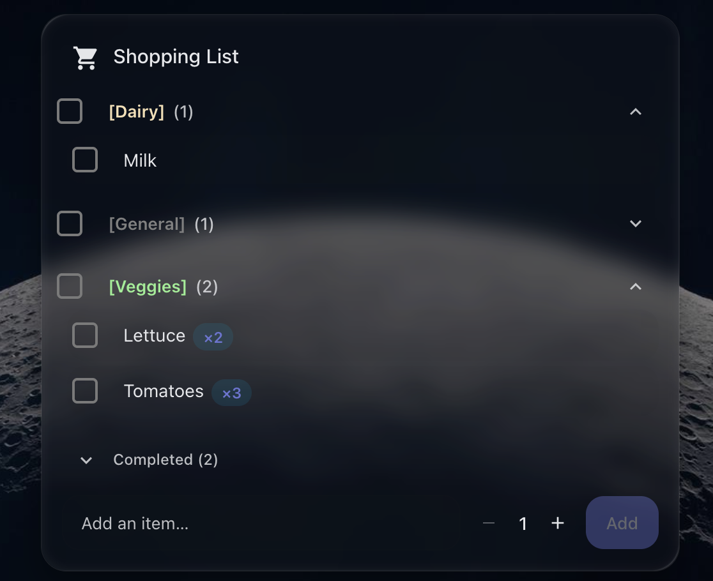

# 🛒 Shopping List Card

[](https://github.com/hacs/integration)
[](https://github.com/MCuello17/ha-shopping-list/releases)
[](LICENSE)

A shopping-style list view for any Home Assistant `todo` entity. Tap to check items off, add new ones inline, edit or remove with hover actions, group by `[Category]`, set quantities, and theme everything down to per-category colors — all from the visual editor or YAML.

Works with the built-in [Local To-do](https://www.home-assistant.io/integrations/local_todo/) integration and any third-party integration that exposes a `todo.<name>` entity (Bring!, Todoist, Google Tasks, etc.).

<p align="center">
  
</p>

## ✨ Features

- **Native `todo` integration** — uses Home Assistant's WebSocket subscription so the list stays in sync across every dashboard, mobile companion, and tab in real time.
- **Inline add / edit / remove** — type to add, hover (or always-on on touch) to edit or delete, no modal dialogs.
- **Quantities** — optional `−/N/+` stepper at add-time and edit-time, with an optional max cap. Stored unobtrusively in the item summary as `<quantity: N>` so other clients still see a readable name.
- **Categories** — prefix items with `[Category]` to bucket them. Optional grouped view with collapsible sections, "check-all" headers, custom per-category colors, and a configurable label for uncategorized items.
- **Configurable completed display** — show completed items at the bottom (default), inline with active items, in a collapsible "Completed (N)" section, or hide them entirely.
- **Sorting** — manual (HA's order), alphabetical, or by created date. Sort applies inside groups when categories are on.
- **Add-bar position** — top (under the header) or bottom (below the list). Toggleable click-to-check on rows.
- **Theme-aware styling** — every color and dimension is a CSS custom property routed through HA's `--rgb-*` variables, so it follows light/dark themes automatically.
- **Customization slots** — drop-in custom CSS via `style:` or `card_mod:`, plus a YAML editor for category colors. All `.sl-*` class names are stable.
- **Visual editor** — collapsible sections for Header / To-do items / Quantities / Completed items / Add items / Categories / Customization. Every option has a label and a sensible default.

## ✅ Prerequisites

- A `todo.<name>` entity in Home Assistant.
  - Built-in: enable [Local To-do](https://www.home-assistant.io/integrations/local_todo/) under **Settings → Devices & Services → Add Integration**.
  - Or use any integration that exposes a `todo` entity (Bring!, Todoist, Google Tasks, AnyList via custom integrations, etc.).
- Home Assistant **2023.11** or newer (the version that introduced the `todo` integration platform).

## 🚀 Installation

### HACS (recommended)

1. Make sure [HACS](https://hacs.xyz/) is installed.
2. In HACS, open the **⋮** menu in the top right → **Custom repositories**.
3. Add `https://github.com/MCuello17/ha-shopping-list` with category **Dashboard** (formerly "Lovelace"), then **Add**.
4. Find **Shopping List Card** in the HACS list and click **Download**.
5. Refresh your browser (hard reload — `Ctrl/Cmd + Shift + R`).
6. Add the card to a dashboard — it appears as **Shopping List Card** in the card picker.

> Once the repo is added to the [default HACS index](https://hacs.xyz/docs/faq/custom_repositories/), step 2–3 will go away and you can install it from a search.

### Manual

1. Download `ha-shopping-list-card.js` from the [latest release](https://github.com/MCuello17/ha-shopping-list/releases) (or from `dist/` on `main`).
2. Copy it to `<config>/www/community/ha-shopping-list/` (any path under `<config>/www/` is fine).
3. Register the resource: **Settings → Dashboards → ⋮ → Resources → Add Resource**:
   - **URL**: `/local/community/ha-shopping-list/ha-shopping-list-card.js`
   - **Resource type**: `JavaScript Module`
4. Hard-reload the browser and add the card to a dashboard.

## ⚙️ Configuration

The card ships with a full visual editor — add it to your dashboard, pick a `todo` entity, and customize from there.


If you'd rather edit YAML directly:

```yaml
type: custom:shopping-list-card
entity: todo.shopping_list
title: Groceries
icon: mdi:cart
sort: alpha
completed: bottom
enable_quantity: true
quantity_max: 99
enable_categories: true
group_by_category: true
category_colors:
  Veggies: green
  Dairy: "#F4E4BC"
  Frozen: rgb(100, 200, 255)
  Bakery: "#C9A064"
```

### Options

| Name                     | Type    | Default                                        | Description                                                                                                   |
| ------------------------ | ------- | ---------------------------------------------- | ------------------------------------------------------------------------------------------------------------- |
| `type`                   | string  | —                                              | Must be `custom:shopping-list-card`.                                                                          |
| `entity`                 | string  | —                                              | A `todo.<name>` entity. **Required.**                                                                         |
| `title`                  | string  | `Shopping List`                                | Header title.                                                                                                 |
| `icon`                   | string  | —                                              | Optional MDI icon shown next to the title.                                                                    |
| `show_header`            | boolean | `true`                                         | Hide the entire header row when `false`.                                                                      |
| `sort`                   | enum    | `manual`                                       | One of `manual` (HA order), `alpha`, `created`. Sorts inside groups when categories are on.                   |
| `click_to_check`         | boolean | `true`                                         | Click anywhere on a row to toggle checked. Disable to require clicking the checkbox.                          |
| `enable_edit`            | boolean | `true`                                         | Show the pencil edit action on rows (always visible on touch, hover-only on desktop).                         |
| `enable_remove`          | boolean | `true`                                         | Show the delete action on rows.                                                                               |
| `empty_message`          | string  | `Nothing on the list`                          | Message shown when the list is empty.                                                                         |
| `completed`              | enum    | `bottom`                                       | `bottom`, `inline`, `collapse` (collapsible "Completed (N)" group), or `hide`.                                |
| `completed_label`        | string  | `Completed`                                    | Label used by the `collapse` mode.                                                                            |
| `show_add_input`         | boolean | `true`                                         | Show the add-item input + button.                                                                             |
| `add_input_position`     | enum    | `bottom`                                       | `top` (under the header) or `bottom` (below the list).                                                        |
| `add_button_label`       | string  | `Add`                                          | Label of the add button.                                                                                      |
| `enable_quantity`        | boolean | `false`                                        | Show a `−/N/+` stepper on the add row and during inline edit. Items render `Name ×N` when N > 1.              |
| `quantity_max`           | number  | `0`                                            | Upper bound for the stepper. `0` means unlimited.                                                             |
| `enable_categories`      | boolean | `false`                                        | Parse `[Category] Name` prefixes. Required for any of the category options below to take effect.              |
| `group_by_category`      | boolean | `true`                                         | When categories are on: `true` = grouped layout, `false` = flat list with the `[Category]` shown on each row. |
| `category_collapsible`   | boolean | `true`                                         | Show a chevron on each group header to collapse / expand the group.                                           |
| `category_check_all`     | boolean | `true`                                         | Show a "check-all" checkbox on each group header.                                                             |
| `category_show_count`    | boolean | `true`                                         | Show an `(N)` badge on each group header counting items still to be checked off. Hidden when the count is 0.  |
| `general_category_label` | string  | `General`                                      | Bucket label for items with no `[Category]` prefix.                                                           |
| `category_colors`        | object  | `{General: grey, Veggies: green}` (when unset) | Map of category name → CSS color. See [Category colors](#category-colors).                                    |
| `style`                  | string  | —                                              | Custom CSS appended to the card. See [Customization](#-customization).                                        |
| `card_mod`               | object  | —                                              | `card-mod` compatibility — `card_mod: { style: ... }` is also accepted.                                       |

## 🏷️ Categories

Type a `[Category]` prefix in front of any item to bucket it:

```
[Veggies] Lettuce
[Veggies] Tomatoes
[Dairy] Milk
Bread
```

- The brackets are required — items without them land in the **General** bucket (or whatever you set `general_category_label` to).
- Empty brackets (`[] Foo`) are treated as no category.
- The category name supports spaces (`[Pet & Toys] Litter`).

![Categories section of the visual editor expanded. Toggles for Enable categories, Group items by category, Allow collapsing categories, Allow check-all on categories, and Show item count on category headers are all on. A General label field reads 'General'. A Category colors YAML editor lists General: grey, Veggies: lightgreen, Dairy: wheat, Bakery: peru. The live preview on the right shows three group headers — orange [Bakery] (1), tan [Dairy] (1) expanded with Milk underneath, and green [Veggies] (2) collapsed — each bracket label rendered in its mapped color.](docs/images/categories-grouped.png)

### Two layouts

- **Grouped** (`group_by_category: true`, the default): items render under collapsible category headers with optional check-all checkboxes. Sorting applies both **within** each group and **across** groups (alpha sorts groups by name; manual / created uses each group's first-appearance order).
- **Flat with prefix** (`group_by_category: false`): items render as a single list with `[Category]` shown inline on each row.

By default each group header shows a remaining-items count next to the label, e.g. `[Dairy] (2)`. The badge tracks active (unchecked) items only and disappears when the category is fully done. Hide it with `category_show_count: false`.

### Completed items + grouping

When `completed: collapse` is paired with grouping, completed items are lifted out of their categories and shown in **one** global "Completed (N)" section at the bottom of the card. Their `[Category]` prefix and color are still rendered so you can tell where each item came from. The other completed modes (`bottom`, `inline`, `hide`) apply per-group as you'd expect.

![Completed items section of the visual editor open, with 'Show completed items' set to 'Collapsible section' and the group label customized to 'Bought'. The live preview on the right shows the active [Dairy] (1) group collapsed at the top, then a globally expanded 'Bought (3)' section underneath containing three struck-through items pulled from different categories — [Bakery] Bread ×2, [Veggies] Lettuce ×2, and [Veggies] Tomatoes ×3 — each item still rendering its colored category prefix and quantity badge.](docs/images/completed-collapsed.png)

### Category colors

Add a per-category color map under `category_colors`. The color is applied to the bracket label and works with any valid CSS color:

```yaml
category_colors:
  Veggies: green
  Dairy: "#F4E4BC"
  Frozen: rgb(100, 200, 255)
  Bakery: var(--my-token)
```

The visual editor exposes the same map as a YAML editor with starter content. Categories without an entry use the surrounding text color.

## 🔢 Quantities

Enable with `enable_quantity: true`. The stepper appears in two places:

- **Add row** — pick the starting quantity before tapping Add. Resets to 1 after each add.
- **Edit mode** — tap the pencil to change the name and quantity together.

Stored format: the quantity is appended to the item summary as `<quantity: N>`. For example, `Bananas <quantity: 6>`. The marker is hidden on the card and shown as a `×6` badge instead. Other clients (the HA `todo-list` card, mobile companion, Bring!, etc.) just see the raw text — useful as a fallback. Set `quantity_max` to cap the stepper; `0` (default) means unlimited.


## 🎨 Customization

Every visual property is a CSS custom property — change one variable, restyle the whole card. The `style:` config option (and `card_mod`) is applied last so user CSS always wins:

```yaml
type: custom:shopping-list-card
entity: todo.shopping_list
style: |
  .sl-card {
    --shopping-list-radius: 24px;
    --shopping-list-inner-radius: 18px;
    --shopping-list-accent: #ff6f91;
  }
  .sl-item:hover {
    --shopping-list-item-bg-hover: rgba(var(--rgb-primary-color), 0.16);
  }
```

Notable hooks (full list of `.sl-*` classes and `--shopping-list-*` variables in [`src/styles.ts`](src/styles.ts)):

- `--shopping-list-radius`, `--shopping-list-inner-radius` — corner roundness
- `--shopping-list-accent`, `--shopping-list-button-bg` — primary actions
- `--shopping-list-item-bg`, `--shopping-list-item-bg-hover` — item rows
- `--shopping-list-category-color` — category label color (set inline by `category_colors`)
- `--shopping-list-quantity-badge-*`, `--shopping-list-quantity-step-*` — quantity controls

The card is theme-aware out of the box: every color falls back through HA's `--rgb-*` variables, so dark / light themes look right with no extra config.

## 🧰 Development

```bash
npm install            # also installs Git hooks (pre-commit, pre-push)
npm run dev            # build + watch + serve dev harness on http://localhost:5173/dev/
```

Or run the pieces individually:

```bash
npm run build          # one-shot build → dist/ha-shopping-list-card.js
npm run watch          # rebuild on change
npm run serve          # static dev server on :5173
npm run typecheck      # tsc --noEmit
npm run format         # prettier --write
```

The dev harness mocks `hass` in-memory and stubs the `ha-*` web components. It includes presets for every major feature, light / dark + desktop / mobile toggles, and seed buttons for items with quantities and categories. Use real Home Assistant for visual fidelity.

### Built bundle is committed

`dist/ha-shopping-list-card.js` is tracked in git so HACS can install the card directly from the default branch (and from GitHub Releases). The `pre-push` hook rebuilds and verifies that what you're pushing matches the committed source.

## 📄 License

[MIT](LICENSE) © MCuello17
